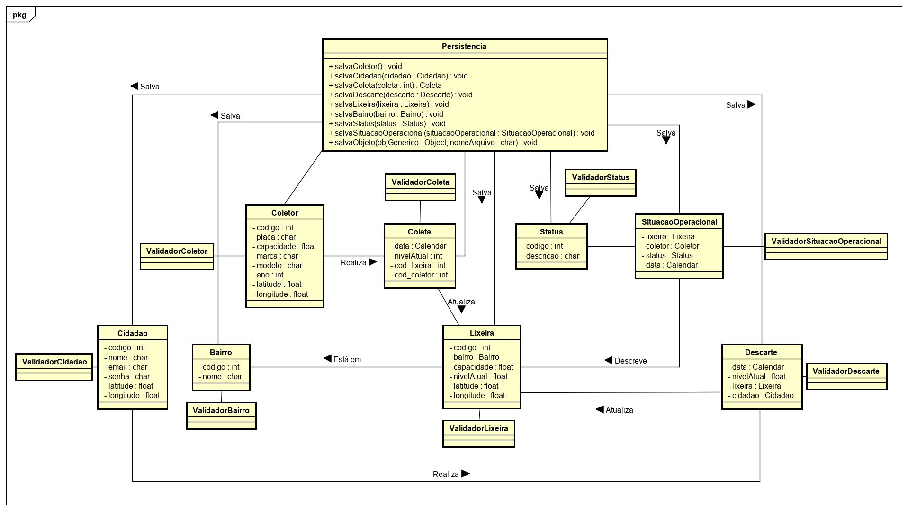

# Coleta Inteligente: Trabalho de POO1

Por Jackson William, Lavínia Corteletti, Thiago Moreira e Vinicius Freitas.

[CANVAS DE AQUECIMENTO](https://docs.google.com/presentation/d/1y6j9EljmDc8kBXV1M4UDpAI0vJILvSqZwEgCBdyqM8s/edit#slide=id.g275249ce01_0_14) 

[PROJECT MODEL CANVAS](https://docs.google.com/presentation/d/1SUEphWJRHx0OEXC3pngmrGb5BeBi2QcvAo6oGUOrLxs/edit?usp=sharing) 

[DIÁRIO DE BORDO](https://docs.google.com/document/d/1N2bfTq--9dVtOqcRP5bTsuJve3REAktGKFht3hsVc0o/edit?usp=sharing) 

# Sumário
+ [INTRODUÇÃO E MOTIVAÇÃO](#introducao)
+ [MINI-MUNDO](#minimundo)
+ [PROTÓTIPOS](#prototipos)
+ [DIAGRAMA DE CLASSE](#diagramaclasse)
+ [TECNOLOGIAS UTILIZADAS](#tecnologias)

## Introdução e Motivação
  O sistema Lixeira Inteligente tem como objetivo auxiliar na coleta e no descarte de lixo. A aplicação auxiliará os cidadãos a encontrar a lixeira mais próxima disponível para o descarte e os coletores a percorrer o melhor trajeto  para o recolhimento de  resíduos das lixeiras consideradas como cheias.  Esse sistema tenta minimizar o problema de descarte de lixo de modo inapropriado, evitando que a cidade fique suja, e também visa criar rotas otimizadas para os coletores a fim de diminuir o desperdício de recursos durante o processo. 
  
## Mini-Mundo
  O sistema Lixeira Inteligente contará com duas versões: uma para o cidadão que permite visualizar uma rota até a lixeira para descarte. E outra versão para o coletor que visualiza a rota de coleta e o administrador que realizará devidos controle de lixeiras e coletores. O sistema deverá obter as informações do cidadão (nome, e-mail, senha) a fim de que o mesmo tenha um cadastro para a utilização da aplicação. Também precisará obter a localização atual do cidadão em coordenadas geográficas (latitude, longitude), para que o sistema possa gerar uma rota com destino à lixeira mais próxima e com uma capacidade viável para o recebimento do lixo. 
 
O sistema deverá permitir cadastrar as lixeiras (capacidade em volume, nível atual, bairro em que ela está instalada, além da sua localização em coordenadas geográficas). Elas também possuem informações sobre a situação operacional (status da lixeira, data e hora ) que tem o objetivo de apresentar a situação atual da lixeira , como por exemplo, se está quebrada ou em manutenção. O sistema deve permitir cadastrar os caminhões coletores (placa, modelo, marca, ano, capacidade em volume) e também precisa obter a localização atual, do mesmo, em coordenadas geográficas. Será gerado para o coletor uma rota de coleta de lixo, por bairro, para que o caminhão percorra um caminho que contenha lixeiras com 70% ou mais de sua capacidade preenchida. O total de lixo das lixeiras acrescentadas na rota de coleta não devem ultrapassar a capacidade do caminhão.

O sistema precisa armazenar informações da coleta (caminhão coletor, nível coletado, data e hora) e descarte (cidadão, nível descartado, data e hora) que serão obtidas durante o processo. Essas informações serão utilizadas para gerar relatório para o administrador.

## Protótipos

[Protótipo de Tela](https://github.com/jalathivi/POO1-Coleta-Inteligente/blob/master/prototipo/tela_coleta_inteligente_poo.pdf) 

## Diagrama de Classe

## Tecnologias Utilizadas
  - **Java 8**: Linguagem de programação utilizada para o desenvolvimento do sistema. 
  - **JUnit**: Framework utilizada para a automatização dos testes. 
  - **PostgreSQL**: Gerenciador de banco de dados utilizado para armazenamento e realização de operações de CRUD. 
  - **JFrame**: Classe do pacote Swing utilizada para produção das telas principais do sistema, recebendo os dados para operações de *get* e *set* das classes mais importantes do sistema.  

